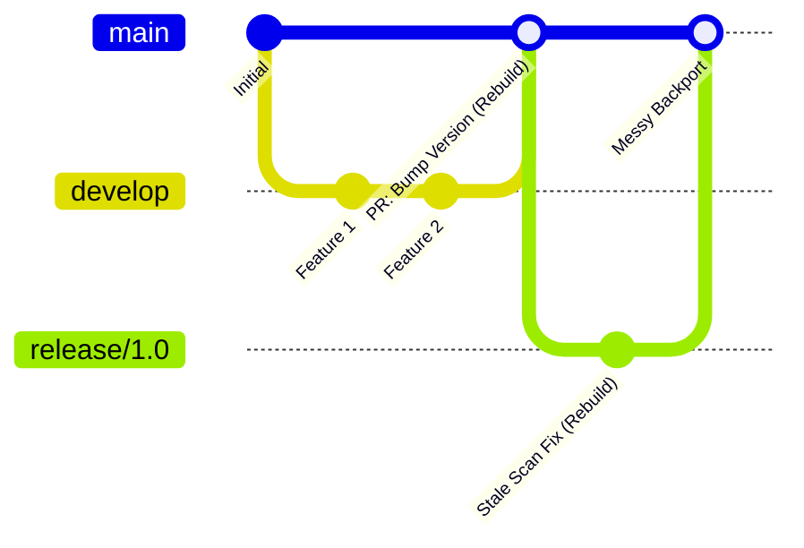
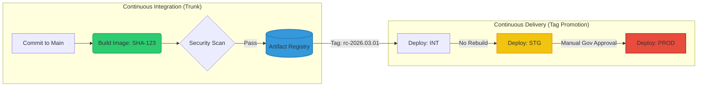

# Bypassing the Velocity Wall: Trunk-Based Development in Regulated Environments

In modern DevOps, Trunk-Based Development (TBD) is the gold standard for speed. However, in highly regulated environments like Banking, we face a **"Velocity Wall"**:

* **Release Cycles:** Deployments to Staging/Production happen every 2 months, not every 2 hours.
* **Audit Friction:** "100 docs," rigorous security scans, and manual approvals are required for every production artifact.
* **The "Obsolete Scan" Trap:** Scans performed at the start of a 2-month window are often deemed "stale" by the time approval is granted, forcing costly rebuilds.

<!-- truncate -->

## The "GitFlow Sandwich" Anti-Pattern

To cope with this friction, teams often introduce a complex web of `develop` and `master` branches to "match" environments. This leads to a "PR Mess" of manual version bumps, constant merge conflicts, and wasted compute cycles rebuilding the same code.

:::warning The Anti-Pattern
Tying branches to environments forces continuous rebuilding and complex backports.
:::

## The Solution: The "Promotion-by-Tag" Model

Instead of using branches to represent environments (which creates an integration tax), we move to a Tag-Based Release strategy. This decouples our Integration (`main`) from our Promotion (Release Candidates).

### 1. Continuous Integration (The Trunk)
Developers merge small, frequent PRs into `main`. CI builds an immutable artifact for every commit. Artifacts are automatically deployed to Internal/Dev (INT) for testing. Scans run immediately.

### 2. The Release Candidate (RC) Hook
When the release scope is confirmed, we do not cut a branch. We Tag the successful commit in `main` (e.g., `git tag rc-2026.03.01`). This tag serves as the "frozen" reference for the auditors.

### 3. Immutable Artifact Promotion
The exact same artifact tested in INT is promoted to Staging. No rebuilds. No "Version PRs" on `main`. The tag is the version.

### 4. Handling Late-Cycle Fixes (The Detached Patch)
If a vulnerability is found during the 2-month approval window, a temporary branch is cut directly from the tag. The fix is applied, a new tag is created (e.g., `rc-2026.03.02`), and the fix is cherry-picked back to `main`.

## Why This Wins for FinOps & DevOps

| Feature | The Impact |
| :--- | :--- |
| **Reduced "PR Tax"** | Eliminates manual version-bump PRs and complex `develop` -> `main` merges. Developers spend time coding, not resolving conflicts. |
| **Immutable Audits** | A Tag provides a 1:1 map between Code → Scan → Artifact → Deployment. Auditors love the explicit traceability. |
| **Shift-Left Security** | Scans run on every `main` commit. By the time you "Tag," you already have 2 months of clean scan history to present to governance. |

:::tip The FinOps Angle: "Build Once, Promote Many"
Every time your CI pipeline runs a build, you are burning compute minutes. In a standard GitFlow model, moving code from Dev -> Staging -> Prod often triggers three separate builds of the exact same codebase just to update environment variables or branch names.

By utilizing immutable tags, you adopt a **"Build Once, Promote Many"** architecture. You pay for the compute to compile the artifact and run the security scan exactly once. Promoting that artifact to Staging or Production is merely a metadata update and an image pull, driving your CI compute costs down significantly while eliminating the risk of configuration drift between environments.
:::

:::note The Takeaway
Don't use Git branches to solve organizational bureaucracy. Use **Tags** to create a stable "Promotion Path" while keeping your development trunk fast, lean, and continuous.
:::